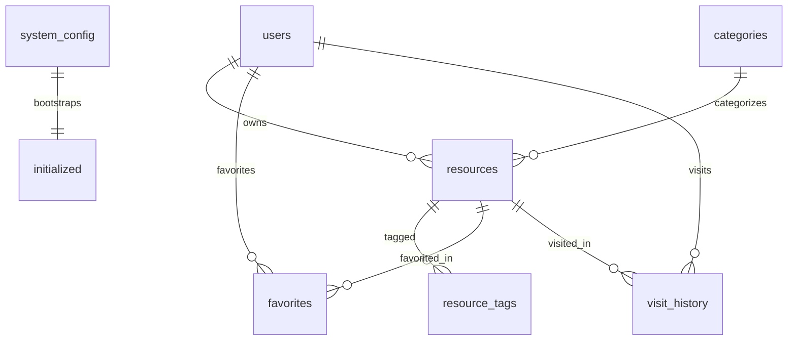

## 资源导航系统数据库概览

> 本文档只保留**表结构关系图和关键约束说明**。  
> 详细字段定义与建表 / 初始化脚本以以下代码为准：  
> - `src/db/schema.ts` — Drizzle 表结构与类型定义  
> - `src/db/migrate.ts` — SQLite DDL 与 Mock 数据写入逻辑

### 1. 表与职责概览

| 表名 | 职责概要 |
|------|----------|
| `users` | 用户账号与角色、密码哈希、启用状态 |
| `categories` | 资源类别（名称、颜色），用于归类导航 |
| `resources` | 具体资源（名称、URL、可见性、描述、启用状态、访问计数、owner 等） |
| `resource_tags` | 资源与标签的多对多关联（资源 ID + 标签文本） |
| `favorites` | 用户收藏的资源集合（用户 ID + 资源 ID） |
| `visit_history` | 用户访问资源的明细记录（带时间戳），用于“最近访问” |
| `visit_hourly` | 聚合后的按小时访问统计，用于首页访问量指标 |
| `system_config` | 系统级配置（标题、副标题、注册策略、token 过期时间等），单行表 |
| `email_config` | 邮件服务配置（SMTP、发件人信息等），单行表 |
| `reset_tokens` | 密码重置 token（token 字符串、邮箱、过期时间、是否已用） |
| `initialized` | 系统是否完成初始化的标记，单行表 |

### 2. 表关系图

下图为核心数据表之间的关系示意（仅保留与业务相关的主要连接）：

说明：

- `users` 与 `resources`：一对多，`resources.owner_id` 指向资源 owner。删除用户前必须先将其资源 owner 转移给其他管理员。
- `categories` 与 `resources`：一对多，`resources.category_id` 可为空，删除类别时相关资源的类别被置空而不是被删除。
- `resources` 与 `resource_tags`：一对多（从标签表视角是多对一），同一资源可有多个标签；同一标签可出现在多个资源上，实现多对多关系。
- `users` / `resources` 与 `favorites`：两边一对多，共同组成用户收藏某资源的关系。
- `users` / `resources` 与 `visit_history`：两边一对多，记录某用户在某时间访问某资源。
- `system_config` 与 `initialized`：不在业务上强绑定，但在初始化流程中配合使用，用于判断系统是否完成首轮配置并写入默认配置。

### 3. 关键约束与业务规则

- **时间字段**：所有时间戳统一使用 Unix 秒整数存储（如 `created_at`、`updated_at`、`visited_at`）。
- **密码存储**：用户密码只以哈希形式存储在 `users.password_hash` 中（bcrypt），不在任何表中保存明文。
- **访问历史上限**：业务层保证 `visit_history` 每个用户最多保留 200 条记录，新记录插入后会删除最旧的多余记录。
- **级联删除与 owner 转移**：
  - 删除资源时，相关的标签关联、收藏、访问历史通过外键 `ON DELETE CASCADE` 自动删除。
  - 删除用户前必须先将其资源的 `owner_id` 更新为执行删除操作的管理员，否则外键限制会阻止删除；其收藏与访问历史会通过级联删除清理。
- **单行配置表**：
  - `system_config` 和 `email_config` 均为单行表，`id` 固定为 `'default'`；`initialized` 也同样通过固定 ID 记录初始化状态。

如需修改数据库结构（新增字段、调整约束等），请同时更新：

- `src/db/schema.ts` 中对应表的定义；
- `src/db/migrate.ts` 中的建表 / 迁移逻辑；
- 并根据需要补充或调整本文件的关系说明。 
